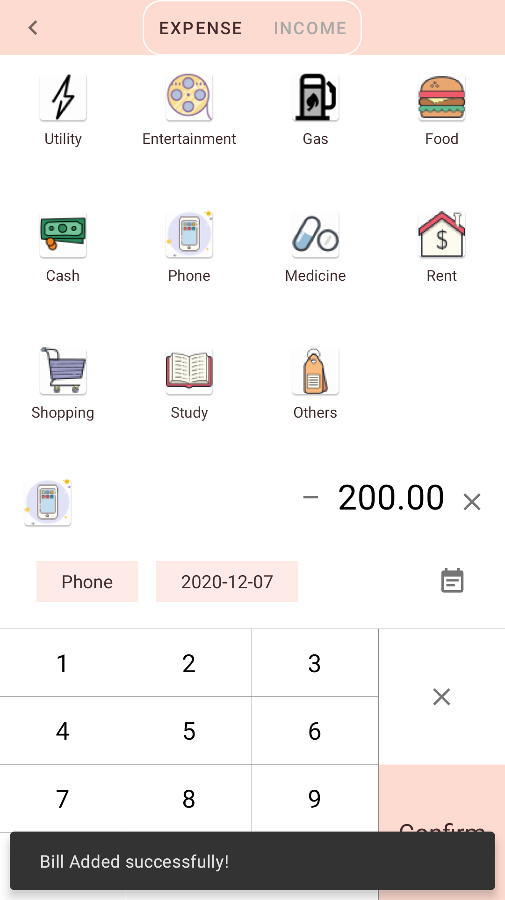

# MyBill

## CSCI 4176 Project
### Dalhousie University
#### Yanlin Zhu
#### B00812966

***

### About This App
This is the project app designed for CSCI 4176. It is a bill recording app that can let user record their daily expenditure and put them into different categories.

MinSDK：26

TargetSDK： 29

Tested on Pixel 2

### Functions
- [x] User can login/register to the app
- [x] User can add daily expenditure or income to the app
- [x] User can put each bill into a type category
- [x] User can see icons represents each category in both stored and about to add page
- [x] User can set time to each bill
- [x] All recorded bills will be displayed from latest to oldest
- [x] User can change the avatar from their photo gallery
- [x] User can use camera to take photos for avatar
- [ ] App will generate chart report based on stored bills
- [ ] App can let user select bills from a period of time
- [ ] Add pattern lock to protect privacy
- [ ] User can set saving goal or budget
- [ ] User can change app theme

### Use Case

When a user first use MyBill, he/she will be directly lead to the main dashboard. The user cam explore the UI of the app including see drawer menu, switch between detail and chart(Not developed yet) by viewpager. However, the user can not use any function without login first. When they click on Sync, Logout, Settings in the drawer menus or float action button, a warning will pop up asking him/her to login by click drawer menu header.

    
    

***

Then, User move to login page. As a new user, he/she must be register first. If anything the user entered is not valid, a error message will pop up. After register successfully, a success message will pop up and ask user go back to login page to login. The username and password have already been stored in the input filed, so he/she does not need to enter again. After Login the user will be lead to main dashboard again.

    
    

    
    

***

After Login, User can use all functions. The first part is edit his/her user setting. A newer will be assigned a default avatar. He/she can change the avatar by clicking the drawer header or settings. In the setting page, user can click avatar to change his/her avatar by taking a photo or selecting from gallery.  User can also change their email, but the username can not be changed.

    
    

    
    

    
    

***

Then, it comes to the core function, add bills. As this part is a little bit more complex, the preview will only include the view and the operation will be  explained in text.

    
    

As shown in picture 1, before user selects a group, it will be displayed as the default type. As bill can not be added if its image and type name is default. After user made a selection, he/she can click the embed keyboard to enter the amount. The number entered will be considered as integer until dot is pressed. The top x is clear all amount entered and the lower x is to delete the last number entered including dot. When the user click the tab or swipe screen to switch between expense and income section, all number entered will be clear and the type image and name will be changed to default.  As for the date, the default date will be current date and user can change it manually if they are creating a bill for other date.

***

After bills are added to user account, every time the user login his/her dashboard will show all the results. As for now, online remote database powered by Bmob is implemented,  the process of retrieving  data may take few seconds. And sometime data may not be updated, the user need to click sync in drawer menu to restart the activity to refresh data. This also happens when you delete a bill and it diapered from your dashboard but the top data is not updated. Sync can be used for this case.

    
    

### Conclusion

The project is not finished due to the heavy work load and intensive schedule of online courses. With the practical experience of this project, I have gain more deeper understanding of Android development. I might continue or rebuild the whole app in winter term as I have decided to decrease course number from 6 to 4  😉

##### References：
[1] Some code reused from Android template by Android Studio

[2] Some code referred to lab content

[3] Remote Server from [Bmob](https://www.bmob.cn/)

[4] Open source [swipeDelMenuLayout](SwipeDelMenuLayout)

[5] [MPAndoirdChart](https://github.com/PhilJay/MPAndroidChart)

[6] The open source image loading framework [Glide](https://github.com/bumptech/glide) to deal to user avatar

[7] [PictureSlector](https://github.com/wildma/PictureSelector)
